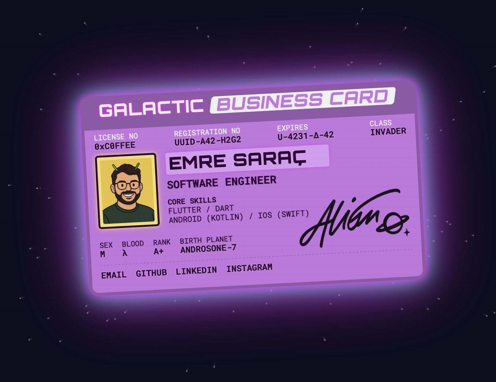

# srcemre.github.io

Digital business card and personal site.  
Built with **Jekyll** and a custom space-themed ID card layout.



Live site: **https://emresarac.com.tr**

## Tech Stack

- **Jekyll**
- **HTML / CSS / SCSS**
- **Vanilla JavaScript**
- Deployed via **GitHub Pages**

## Getting Started
To run this site locally with Jekyll (requires Ruby, Bundler and Jekyll):

```bash
git clone https://github.com/<username>/<repo-name>.git
cd <repo-name>

bundle install
bundle exec jekyll serve
```